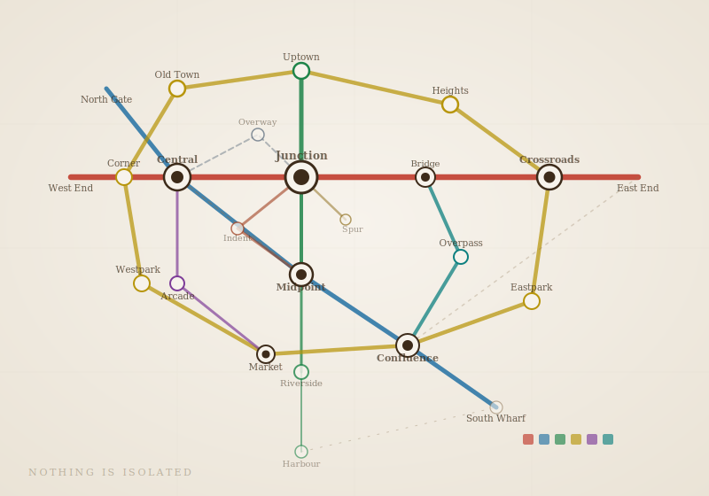
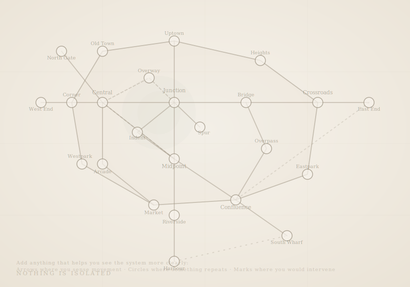

# Nothing is Isolated

### Systems Thinking Lab

*A Self-Learning Foundation for Visual Communication Students*

---

# 👀 Before You Read Anything

Look at this.

---

A network of lines and nodes.
It might remind you of something you've seen before.

---

Now ask:

* Which parts feel more connected than others?
* Where does your eye keep returning?
* If something changed in one dense area, where would the effect spread?

Follow one path with your eyes.

Start anywhere.
Move along the connections.

Where do you end up?
Can you come back to where you started?

You don't need to fully understand it.

Just notice what you can already see.

> If you had to change how this system behaves, where would you intervene?

---

Now continue.

---

# 🧭 Before You Continue

This is not a normal course.

There are:

* No lectures
* No correct answers
* No fixed pace

You may feel:

* Confused
* Slower than others
* Unsure if you're "doing it right"

That's expected.

---

## Your only job

Stay with things longer than feels comfortable.

---

## One rule

> If this starts feeling easy or repetitive, you're doing it wrong.

---

# 🧠 How This Lab Works

You will move through **phases**, not weeks.

Each phase shifts how you see the world.

Each phase has a different intensity:

* 🟢 Light → Observe
* 🟡 Medium → Trace / Act
* 🔴 Heavy → Rethink / Change

Move forward when you feel ready.
Not when you feel "done."

---

# PHASE 1 — SEE

### 🟢 Light

## Shift

From: *objects*
To: *systems*

---

## Exploration: Break a simple thing

Pick one:

* A chai stall
* Your college canteen
* A bus stop

Map it visually.

Include:

* People
* Objects
* Invisible elements (rules, habits, money, time)

**Constraint:**
Do not write first. Only draw.

You may find yourself drawing in a way that looks familiar.

---

## Disruption

Remove one element:

* No cash
* No seating
* No peak hour

Observe what changes.

---

## Prompt (👀 Observational)

> What is happening here that most people are not noticing?

---

# PHASE 2 — TRACE

### 🟡 Medium

## Shift

From: *things matter*
To: *connections matter more*

---

## A note before you begin this phase

Some systems advantage certain people more than others.

When you ask who benefits and who doesn't,
you may notice things that feel uncomfortable or unfair.

Do not rush to judge or fix.

First, learn to see clearly.

---

## Exploration: Follow one interaction

Pick one:

* Ordering food
* Posting online
* Asking a question in class

Trace it end-to-end.

Map:

* Trigger
* Response
* Outcome

---

## Disruption: Change only relationships

Do not change elements.

Examples:

* Anonymous questions
* No "likes"
* Delayed responses

Observe behavior shifts.

---

## Prompt (👀 Observational)

> Who benefits from this interaction working the way it does—and who doesn't?

---

# PHASE 3 — LOOP

### 🔴 Heavy

## Shift

From: *linear thinking*
To: *circular thinking*

---

## Before you begin: Feel the loop

Before mapping anything, notice this:

Pick one:

* Open a social media app
* Delay a task you should be doing
* Check your phone without thinking

Now pause.

Ask:

* What just triggered that?
* What did I get from it?
* Why will I likely do it again?

You are inside a loop.

---

## Contrast: Not all systems behave the same way

### Example — A mostly linear system

Think of how food moves through your body:

* It enters
* Gets processed
* Leaves

This is a forward-moving system.

---

### Compare that to your earlier experience

Some systems move forward and exit.
Others keep feeding back into themselves.

You've already seen both—whether you noticed it or not.

---

## Exploration: Find loops

Look for repeating patterns:

* Procrastination
* Social media use
* Group discussions

Map cycles:

* Action → Result → Reinforcement → Repeat

---

## Intervention

Pick one loop:

* Break it
  or
* Amplify it

---

## Prompt (⚡ Experiential)

> Where did I feel the loop pulling me back in—even when I noticed it?

---

# PHASE 4 — INTERVENE

### 🟡 Medium (Reset through action)

## Shift

From: *predictable systems*
To: *sensitive systems*

---

This phase is lighter on thinking, heavier on doing.
Do not overthink it.

---

## Exploration: Micro-change experiment

Make one small change:

* Sit somewhere new
* Change notification settings
* Speak first

Track effects over 2–3 days.

---

## Design a nudge

Pick a system:

* Classroom participation
* Hostel behavior
* Group work

Introduce a **tiny intervention**.

---

## Prompt (⚡ Experiential)

> What changed in reality—not in my thinking, but in what people actually did?

---

# PHASE 5 — POSITION

### 🔴 Heavy

## Shift

From: *observer*
To: *participant*

---

## Exploration: Map yourself

Choose a system:

* Friend circle
* Daily routine
* Creative process

Include:

* Yourself as a node

Map:

* What you influence
* What influences you

---

## Intervention: Change yourself

Instead of redesigning the system:

* Change your behavior

---

## Prompt (🪞 Reflective)

> What changed in the system when I changed my behavior?

---

# PHASE 6 — DESIGN

### 🔴 Heavy (Synthesis)

## Shift

From: *understanding systems*
To: *shaping systems*

---

## Challenge

Pick a system:

* College fest
* Online community
* Learning group

---

## Design the system (not the visuals)

Focus on:

* Interactions
* Incentives
* Feedback loops

---

## Final Prompt (⚡ Experiential)

> If someone enters this system, what will it make them do—whether they want to or not?

---

# 🧭 What you should notice now

If you've stayed with this honestly, something has likely shifted.

You may:

* Pause before jumping to solutions
* Notice patterns where you previously saw isolated events
* Question things that used to feel "normal"

More importantly:

You may no longer feel comfortable designing something
without thinking about what it will *do* to people.

---

## Moving forward

Every interface, poster, space, or message you create
will push behavior in some direction.

> What will this make people do?

---

# 🔁 Look again

Return to the visual at the beginning.

---

---

Now notice:

* Where do you now see loops?
* Which parts feel more influential than others?
* Where would you intervene if you had to change it?

---

# ✍️ Try this (optional but powerful)

Now look at this version:

---

---

Add anything that helps you see the system more clearly:

* Arrows where you sense movement
* Circles where something repeats
* Marks where you would intervene

Make the system visible to yourself.
